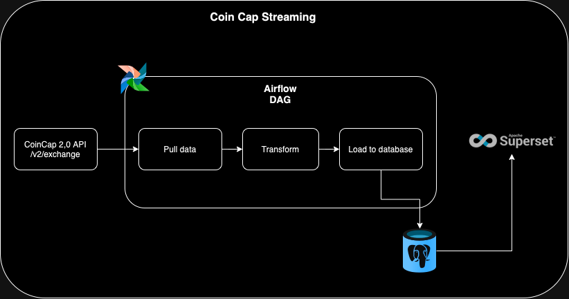

## Bitcoin Exchange Data Streaming

A data engineering project to stream bitcoin data from the CoinCap API. The project is built on Airflow, PostgreSQL and Apache Superset to stream bitcoin exchange data in near real time.

### Data Source
[CoinCap](https://docs.coincap.io) is a useful tool for real-time pricing and market activity for over 1,000 cryptocurrencies. We use the CoinCap 2.0 APIs to fetch and visualize the bitcoin exchange data.

### Architecture

### Build the project
- Create and activate a new virtual environment using venv by running the following commands:

        python -m venv <env_name>
        source <env_name>/bin/activate

- Install the requirements using the txt file.

        pip install -r requirements.txt
- Run the following commands to initialize the services.

        make docker-up
- You can run the following command to stop the services.

        make docker-down

### Migrations
To run the migrations, this project utilized yoyo. You can run the following command to set up the database after it has been spun up.

        make migrate

### Pre Commit Hooks
The project utilizes pre-commit hooks to improve and maintain code quality. You can run the following command to install the hooks.

        pre-commit install

To run the hooks on your code, run the following command.

        pre-commit run -a

You only need to set this up once. For every subsequent run, the environment gets re-used.
